# My Neovim Configuration


Este repositorio contiene mi configuración personalizada de Neovim, diseñada para mejorar mi flujo de trabajo como desarrollador. Me basé en [FStanDev/myNvimConfig](https://github.com/FStanDev/myNvimConfig) para crear esta configuración.

## Estructura del Proyecto

```bash
.
├── img
│   ├── img1.png
│   ├── img...
│   ├── img15.png
│   └── logo.webp
├── init.lua
├── lua
│   ├── base
│   │   ├── init.lua
│   │   ├── keymaps.lua
│   │   ├── notify.lua
│   │   └── plugins
│   │       ├── init.lua
│   │       └── lazy.lua
│   ├── configs
│   │   ├── formating.lua
│   │   ├── lazy.lua
│   │   ├── lspconfig.lua
│   │   ├── lualine.lua
│   │   ├── mason.lua
│   │   ├── nvim-cmp.lua
│   │   ├── nvimtree.lua
│   │   ├── others.lua
│   │   ├── rust-tools.lua
│   │   ├── telescope.lua
│   │   └── utils.lua
│   ├── lualine_themes
│   │   ├── back.lua
│   │   ├── bubbles.lua
│   │   ├── evil.lua
│   │   ├── NovaHacking.lua
│   │   └── slanted.lua
│   └── plugins_lazy
│       ├── editor.lua
│       ├── git.lua
│       ├── markdown.lua
│       ├── spectre.lua
│       ├── terminal.lua
│       └── ui.lua
└── README.md
```

Estructura:

- `img/`: Carpeta que contiene recursos gráficos utilizados para el README.
  - `img1.png` a `img15.png`: Imágenes varias para visualización de la configuración final.
  - `logo.webp`: Logo de Nvim (uso decorativo).
- `init.lua`: Archivo principal que inicializa toda la configuración de Neovim. Carga módulos de la carpeta `lua/`.
- `lua/`: Carpeta principal que contiene toda la configuración modular.
  - `base/`: Contiene la configuración base del editor y del sistema de plugins.
    - `init.lua`: Archivo de entrada para cargar los módulos base.
    - `keymaps.lua`: Algunos atajos de teclado útiles.
    - `notify.lua`: Configuración general de las notificaciones (por ejemplo, `nvim-notify`) y mensaje de bienvenida al abrir Neovim.
    - `plugins/`: Configuración de la carga y organización de plugins.
      - `init.lua`: Carga los archivos necesarios para gestionar plugins.
      - `lazy.lua`: Configuración específica para Lazy.nvim, el gestor de plugins.
  - `configs/`: Contiene configuraciones detalladas para plugins específicos y componentes de Neovim.
    - `formating.lua`: Reglas y formato para mantener un estilo de código consistente.
    - `lazy.lua`: Configuración avanzada y centralizada de Lazy.nvim; los nuevos plugins se agregan en `plugins_lazy`.
    - `lspconfig.lua`: Configuración para servidores de lenguaje (LSP).
    - `lualine.lua`: Configuración para la barra de estado Lualine.
    - `mason.lua`: Configuración de Mason, que permite gestionar servidores LSP, herramientas de depuración y más.
    - `nvim-cmp.lua`: Configuración del autocompletado con el plugin `nvim-cmp`.
    - `nvimtree.lua`: Configuración del árbol de archivos `nvim-tree`.
    - `others.lua`: Configuraciones adicionales no clasificadas en otros archivos.
    - `rust-tools.lua`: Configuración personalizada para trabajar con Rust usando el plugin `rust-tools`.
    - `telescope.lua`: Configuración para `telescope.nvim`, herramienta de búsqueda y navegación.
    - `utils.lua`: Funciones auxiliares reutilizables en la configuración.
  - `lualine_themes/`: Temas personalizados para la barra de estado Lualine.
    - `back.lua`: Tema visual "back".
    - `bubbles.lua`: Tema con estilo de burbujas.
    - `evil.lua`: Tema con inspiración en el estilo de doom-emacs.
    - `NovaHacking.lua`: Tema personalizado, (default).
    - `slanted.lua`: Tema con estilo inclinado.
  - `plugins_lazy/`: Configuraciones divididas por categoría para los plugins cargados mediante Lazy.nvim.
    - `editor.lua`: Plugins orientados al editor (por ejemplo, mejoras de edición).
    - `git.lua`: Plugins relacionados con Git y control de versiones.
    - `markdown.lua`: Plugins orientados a la edición y vista de archivos Markdown.
    - `spectre.lua`: Herramienta para sustituir un texto en todo el proyecto
    - `terminal.lua`: Configuración de terminales embebidas dentro de Neovim.
    - `ui.lua`: Plugins que afectan la interfaz de usuario (temas, íconos, notificaciones, etc.).
- `README.md`: Documento principal que explica cómo usar, configurar e instalar este entorno Neovim personalizado.

## Requisitos Previos

- NVIM v0.10.0 o superior.
- Git para clonar este repositorio.
- Node.js y npm para soporte de algunas características.
- Paquetes: `gcc`, `fzf`, `fd`, `ripgrep`, `deno`, `bat`, `curl` y `lazygit`.

## Instalación

Antes que nada borra configuraciones anteriores de nvim si es necesario:

```bash
rm -rf ~/.config/nvim
rm -rf ~/.local/share/nvim
```

> **Nota**: Tambien pude hacer una copia de seguridad.

Clona este repositorio en tu directorio de configuración de Neovim y ejecuta nvim, se instalará todos los paquetes de Lazy necesarios automáticamente: 

```bash
git clone https://github.com/anonymous-17-03/My_Nvim.git ~/.config/nvim && nvim
```

Cuando se instalen todos los complementos de Lazy, ejecute `:MasonInstallAll` para instalar los paquetes de Mason dentro de nvim, hay un menú personalizado adicional que puede instalar de la siguiente manera:

```bash
git clone https://github.com/anonymous-17-03/menu
cd menu && cp novahacking.lua ~/.local/share/nvim/lazy/menu/lua/menus
```
Y listo 😀, al entrar de nuevo a `nvim` vera:


## Lenguajes añadidos previamente

- Python
- Lua
- TypeScript
- Astro
- Svelte
- Bash
- C y C++
- Go
- Rust
- HTML
- PHP

## 🧠 Tecla Líder

La tecla líder (leader key) está configurada como el espacio (`<Space>`). Esto significa que puedes utilizar combinaciones como `<leader>ff` para buscar archivos con Telescope o `<leader>l` para acceder a comandos relacionados con LSP, si se presiona solo el espacio `which-key` mostrará las posibles combinaciones de tecla y que hacen.

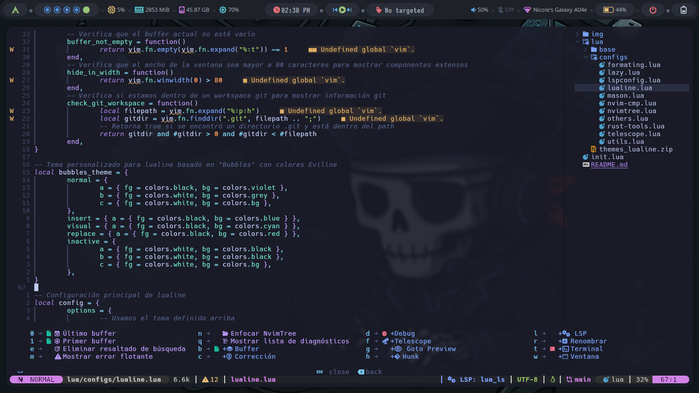

También se instaló un plugin (CheatSheet) para que pueda tener un panorama completo de todas las posibles combinaciones de tecla, puede acceder a ella con `<leader>a`:

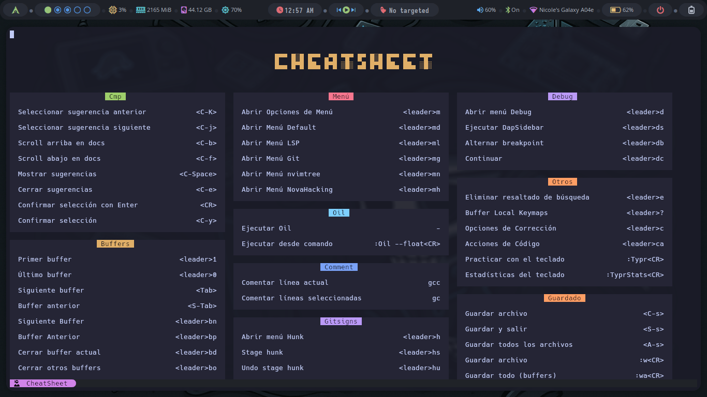

## 🔢 Configurar Números de Línea

Puedes alternar entre números de línea relativos y absolutos en el archivo `lua/base/init.lua`. Las siguientes líneas controlan esta configuración:

```lua
-- Mostrar números de línea
vim.wo.number = true          -- Línea actual en formato absoluto
vim.wo.relativenumber = true  -- Otras líneas en formato relativo
```

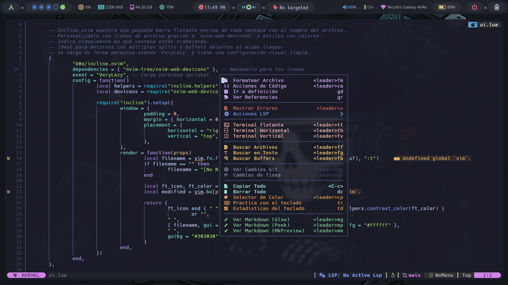

> **Nota**: Para ver el menú de la imagen precione: `<leader>mh`.

Estamos en la línea 24, pero tanto hacia riba como hacia abajo se empieza a contar desde 1, para mostrar solo números absolutos, establece `vim.wo.relativenumber = false`.

## 🎨 Personalizar Apariencia: Fondo y Temas

La apariencia del editor se configura en `lua/plugins_lazy/ui.lua`. Actualmente, se utiliza el tema `tokyonight` con fondo transparente. Si prefieres un fondo sólido, modifica la siguiente línea de la siguiente manera:

```lua
for _, group in ipairs(highlight_groups) do
	-- Para fondo solido usar -> guibg=#1f2335 o el color que desee.
	vim.cmd("hi " .. group .. " guibg=#1f2335 ctermbg=NONE")
end
```

#### Transparente

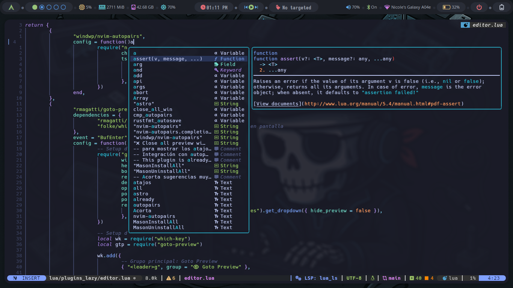

#### Sólido

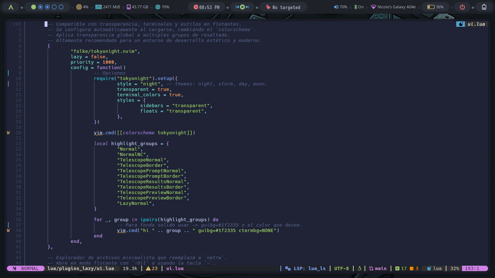

Si deseas utilizar un tema diferente, comenta o elimina esta configuración y añade la correspondiente al nuevo tema que prefieras.

## 🔌 Agregar Nuevos Plugins

Para añadir nuevos plugins utilizando Lazy.nvim, simplemente edita el archivo correspondiente en `lua/plugins_lazy/` según la categoría del plugin. Por ejemplo, si deseas agregar un plugin relacionado con la interfaz de usuario, edita `lua/plugins_lazy/ui.lua` y añade una entrada como la siguiente:

```lua
{
  "autor/plugin-ejemplo",
  config = function()
    require("plugin-ejemplo").setup({})
  end,
},
```

#### Lazy

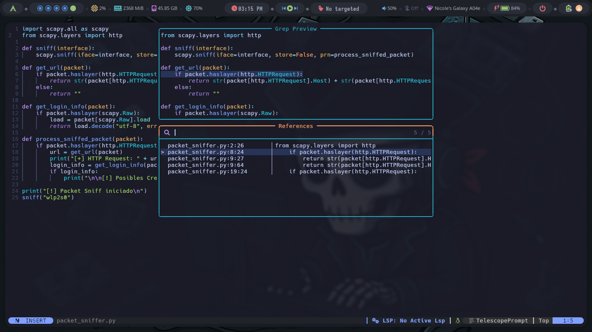

Lazy.nvim se encargará de gestionar la instalación y carga del plugin automáticamente.

## 🧰 Configuración de Mason y Formateo

### 📦 Mason: Gestor de herramientas LSP, DAP y formatters

Mason permite instalar fácilmente servidores de lenguaje (LSP), depuradores (DAP) y herramientas de formateo desde Neovim.

#### 📁 Archivo: `lua/configs/mason.lua`

Aquí se encuentra la configuración principal de Mason. Puedes personalizar el estilo de la interfaz y las herramientas que deben instalarse automáticamente.

```lua
return {
	ui = {
		border = "rounded", -- Requiere que Neovim tenga soporte para bordes redondeados
		borderchars = { "─", "│", "─", "│", "╭", "╮", "╯", "╰" },
		icons = {
			package_installed = "✓",
			package_pending = "➜",
			package_uninstalled = "✗",
		},
	},
	-- Herramientas que se instalarán automáticamente
	ensure_installed = {
		"lua-language-server",       -- LSP para Lua
		"stylua",                    -- Formateador para Lua
		"rust-analyzer",             -- LSP para Rust
		"pyright",                   -- LSP para Python
		"clangd",                    -- LSP para C y C++
		"prettier",                  -- Formateador para web (JS, TS, HTML, etc.)
		"rustfmt",                   -- Formateador para Rust
		"black",                     -- Formateador para Python
		"isort",                     -- Ordenador de imports para Python
		"typescript-language-server",-- LSP para JS/TS
		"svelte-language-server",    -- LSP para Svelte
		"codelldb",                  -- Depurador para C/C++
		"debugpy",                   -- Depurador para Python
		"bash-language-server",      -- LSP para Bash
		"shfmt",                     -- Formateador para Bash
		"astro-language-server",     -- LSP para Astro
		"html-lsp",                  -- LSP para HTML
		"intelephense",              -- LSP para PHP
		"php-cs-fixer",              -- Formateador para PHP
		"gopls", -- LSP para GO
		"gofumpt", -- Formateador para GO
		"goimports", -- Formateador para GO
	},
	max_concurrent_installers = 7, -- Máximo de herramientas instaladas simultáneamente
}
```

> **Nota**: Los servidores se instalan con el comando `:MasonInstall shfmt` o `MasonInstallAll`  Para instalar los paquetes en la lista `ensure_installed`, luego puede agregarlos y configurarlos en `lua/configs/lspconfig.lua`, ejemplo:

```lua
lspconfig.gopls.setup({}) -- GO
```

#### Mason

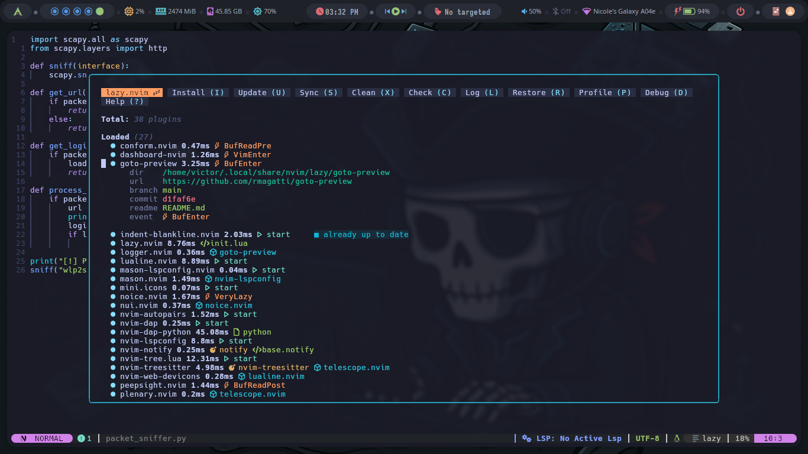

### ✨ Formateo Automático Multilenguaje

Esta configuración permite formatear tu código automáticamente al guardar el archivo, y define qué herramientas usar por tipo de archivo.

#### 📁 Archivo: `lua/configs/formating.lua`

```lua
return {
	-- Asignación de formateadores por tipo de archivo
	formatters_by_ft = {
		-- Web
		javascript = { "prettier" },
		typescript = { "prettier" },
		javascriptreact = { "prettier" },
		typescriptreact = { "prettier" },
		svelte = { "prettier" },
		css = { "prettier" },
		html = { "prettier" },
		json = { "prettier" },
		yaml = { "prettier" },
		graphql = { "prettier" },
		php = { "php-cs-fixer" },

		-- Lua
		lua = { "stylua" },

		-- Python
		python = { "isort", "black" }, -- isort ordena los imports, black formatea el código

		-- Rust
		rust = { "rustfmt" },

		-- Bash
		bash = { "shfmt" },
		sh = { "shfmt" },

		-- Docker
		dockerfile = { "prettier" },

        -- GO
		go = { "gofumpt", "goimports" },
	},

	-- Configuración global del autoformateo al guardar
	format_on_save = {
		lsp_fallback = true,   -- Usa formateadores externos si el LSP no soporta formateo
		async = false,         -- Espera a que termine el formateo antes de continuar
		timeout_ms = 1000,     -- Tiempo máximo en milisegundos
	},
}
```

#### ➕ ¿Cómo añadir nuevos formateadores?

1. Instala el binario correspondiente con Mason (por ejemplo, `shfmt`).
2. Añade el tipo de archivo a la tabla `formatters_by_ft`:

```lua
bash = { "shfmt" },
```

3. Reinicia Neovim para aplicar los cambios.

## Características

- Lazy.nvim: Gestión eficiente de plugins.
- LSP Config: Soporte para múltiples lenguajes de programación.
- Telescope: Búsqueda rápida en el proyecto.
- Lualine: Barra de estado personalizada.
- NvimTree: Explorador de archivos tipo árbol.
- Mason: Gestión de herramientas de desarrollo como LSPs y DAPs.
- Rust Tools: Mejor soporte para desarrollo en Rust.
- Previsualización de archivos Markdown con los siguientes comandos: `:Glow`, `:MarkdownPreview` y `:PeekOpen`.
- Y muchas más funcionalidades (Puede ver el código completamente documentado).

## Capturas de Pantalla

A continuación, se muestran algunos ejemplos de cómo se ve la configuración final de nvim:


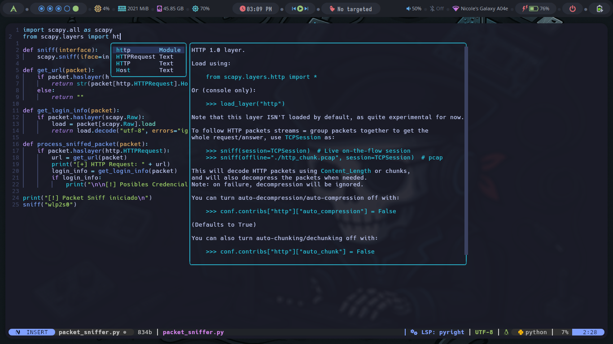

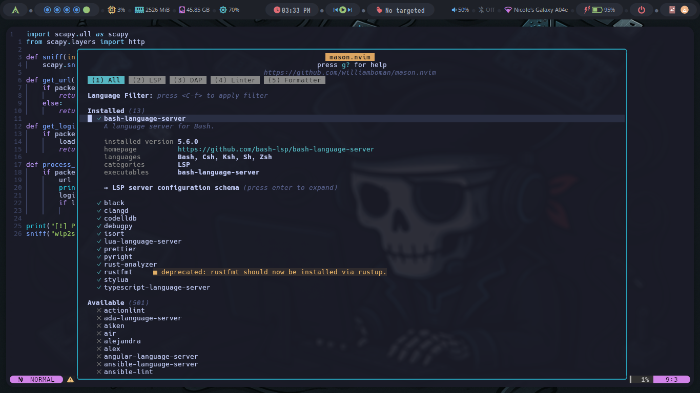

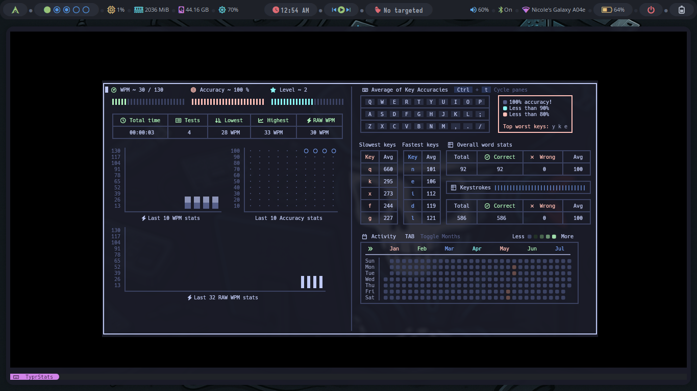

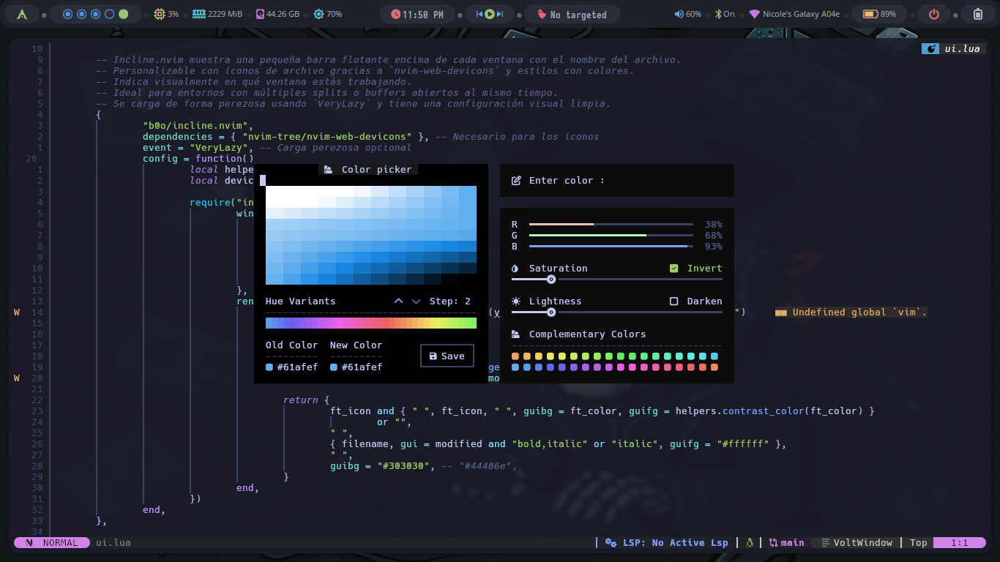

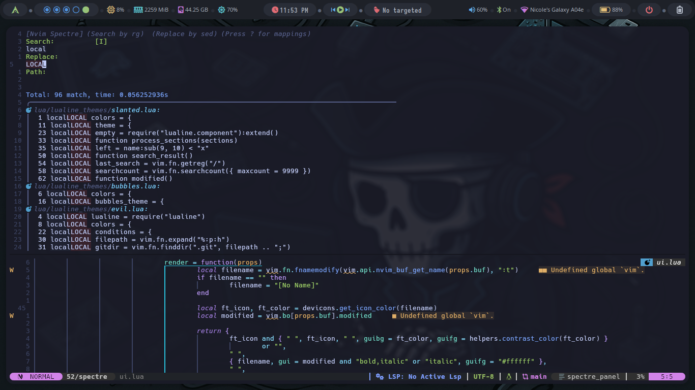

## Créditos

[FStanDev](https://youtu.be/RYAfhkw_1QQ?si=A1tYsU0XbrQSYIlG) por la inspiración inicial.

## Contribuciones

Las contribuciones son bienvenidas. Por favor, abre un issue o pull request para discutir cualquier cambio.
