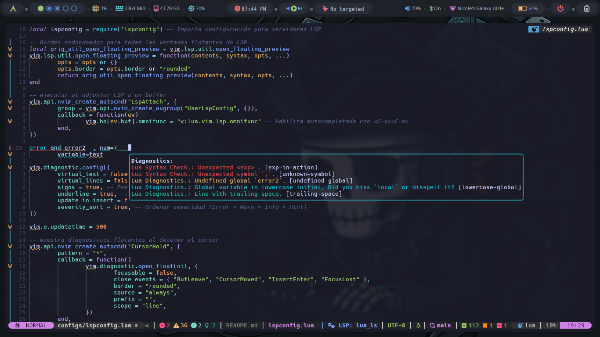

# My Neovim Configuration


Este repositorio contiene mi configuración personalizada de Neovim, diseñada para mejorar mi flujo de trabajo de desarrollo. Me basé en [FStanDev/myNvimConfig](https://github.com/FStanDev/myNvimConfig) para crear esta configuración.

## Estructura del Proyecto

```bash
.
├── init.lua
├── lazy-lock.json
└── lua
    ├── base
    │   ├── init.lua
    │   └── plugins
    │       ├── init.lua
    │       └── lazy.lua
    ├── configs
    │   ├── formating.lua
    │   ├── lazy.lua
    │   ├── lspconfig.lua
    │   ├── lualine.lua
    │   ├── mason.lua
    │   ├── nvim-cmp.lua
    │   ├── nvimtree.lua
    │   ├── others.lua
    │   ├── rust-tools.lua
    │   ├── telescope.lua
    │   └── utils.lua
    └── themes_lualine.zip
```

- init.lua: Archivo principal que carga la configuración base.
- lazy-lock.json: Archivo generado por Lazy.nvim para gestionar las dependencias de los plugins.
- lua/base: Contiene la configuración básica de Neovim y la gestión de plugins.
- init.lua: Configuración inicial.
- plugins/init.lua: Configuración general de los plugins.
- plugins/lazy.lua: Configuración específica de Lazy.nvim.
- lua/configs: Directorio con configuraciones específicas para plugins y funcionalidades.
- formating.lua: Configuración de formateo de código.
- lazy.lua: Configuración avanzada para Lazy.nvim.
- lspconfig.lua: Configuración para LSP (Language Server Protocol).
- lualine.lua: Configuración de la barra de estado Lualine.
- mason.lua: Configuración de Mason para la gestión de LSPs, DAPs, etc.
- nvim-cmp.lua: Configuración del complemento de autocompletado.
- nvimtree.lua: Configuración para NvimTree, un árbol de archivos.
- others.lua: Configuraciones adicionales.
- rust-tools.lua: Configuración para Rust Tools.
- telescope.lua: Configuración de Telescope para búsqueda en el proyecto.
- utils.lua: Funciones utilitarias.
- themes_lualine.zip: Archivo comprimido que contiene temas personalizados para Lualine.

## Requisitos Previos

- Neovim 0.8 o superior.
- Git para clonar este repositorio.
- Node.js y npm para soporte de algunas características.

## Instalación

Antes que nada borra configuraciones anteriores de nvim si es necesario:

```bash
rm -rf ~/.config/nvim
rm -rf ~/.local/share/nvim
```

Clona este repositorio en tu directorio de configuración de Neovim y ejecuta nvim:

```bash
git clone https://github.com/anonymous-17-03/My_Nvim.git ~/.config/nvim && nvim
```

## Notas

Las 2 notificaciones al entrar a nvim son de ejemplo pueden editarlas en los archivos de configuración.
El archivo se encuentra en `lua/base/init.lua` en el apartado `-- Configuración global`

## Características

- Lazy.nvim: Gestión eficiente de plugins.
- LSP Config: Soporte para múltiples lenguajes de programación.
- Telescope: Búsqueda rápida en el proyecto.
- Lualine: Barra de estado personalizada.
- NvimTree: Explorador de archivos tipo árbol.
- Mason: Gestión de herramientas de desarrollo como LSPs y DAPs.
- Rust Tools: Mejor soporte para desarrollo en Rust.

## Capturas de Pantalla

A continuación, se muestra un ejemplo de cómo se ve la configuración final de nvim:




## Créditos

FStanDev por la inspiración inicial.
Contribuciones
Las contribuciones son bienvenidas. Por favor, abre un issue o pull request para discutir cualquier cambio.
