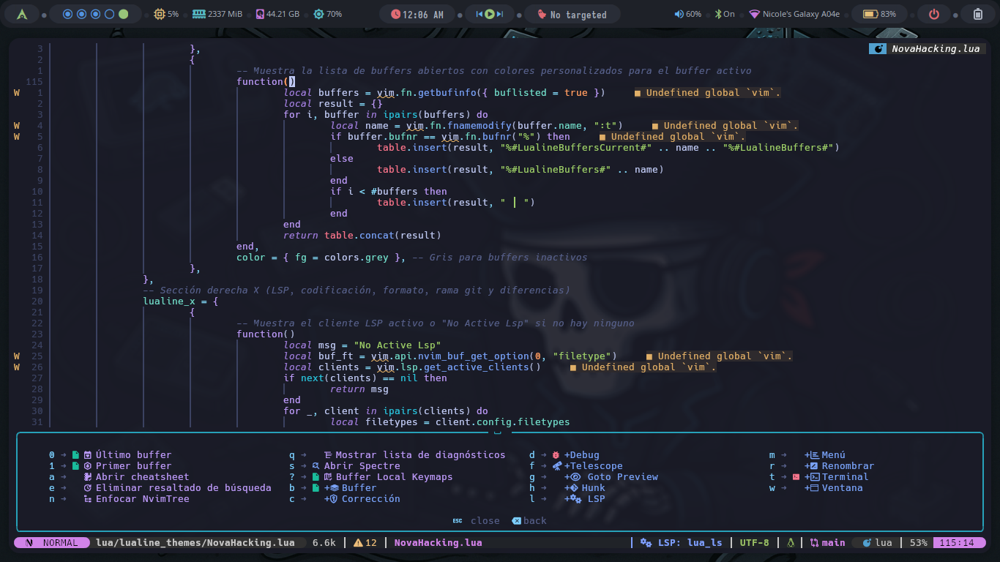

# My Neovim Configuration


Este repositorio contiene mi configuración personalizada de Neovim, diseñada para mejorar mi flujo de trabajo de desarrollo. Me basé en [FStanDev/myNvimConfig](https://github.com/FStanDev/myNvimConfig) para crear esta configuración.

## Estructura del Proyecto

```bash
.
├── img
│   ├── img10.png
│   ├── img1.png
│   ├── img2.png
│   ├── img3.png
│   ├── img4.png
│   ├── img5.png
│   ├── img6.png
│   ├── img7.png
│   ├── img8.png
│   ├── img9.png
│   └── logo.webp
├── init.lua
├── lua
│   ├── base
│   │   ├── init.lua
│   │   ├── keymaps.lua
│   │   ├── notify.lua
│   │   └── plugins
│   │       ├── init.lua
│   │       └── lazy.lua
│   ├── configs
│   │   ├── formating.lua
│   │   ├── lazy.lua
│   │   ├── lspconfig.lua
│   │   ├── lualine.lua
│   │   ├── mason.lua
│   │   ├── nvim-cmp.lua
│   │   ├── nvimtree.lua
│   │   ├── others.lua
│   │   ├── rust-tools.lua
│   │   ├── telescope.lua
│   │   └── utils.lua
│   ├── lualine_themes
│   │   ├── back.lua
│   │   ├── bubbles.lua
│   │   ├── evil.lua
│   │   ├── NovaHacking.lua
│   │   └── slanted.lua
│   └── plugins_lazy
│       ├── editor.lua
│       ├── git.lua
│       ├── markdown.lua
│       ├── terminal.lua
│       └── ui.lua
└── README.md
```

Estructura:

- `img/`: Carpeta que contiene recursos gráficos utilizados para el README.
  - `img1.png` a `img10.png`: Imágenes varias para visualización de la configuración final.
  - `logo.webp`: Logo de Nvim (uso decorativo).
- `init.lua`: Archivo principal que inicializa toda la configuración de Neovim. Carga módulos de la carpeta `lua/`.
- `lua/`: Carpeta principal que contiene toda la configuración modular.
  - `base/`: Contiene la configuración base del editor y del sistema de plugins.
    - `init.lua`: Archivo de entrada para cargar los módulos base.
    - `keymaps.lua`: Algunos atajos de teclado útiles.
    - `notify.lua`: Configuración general de las notificaciones (por ejemplo, `nvim-notify`) y mensaje de bienvenida al abrir Neovim.
    - `plugins/`: Configuración de la carga y organización de plugins.
      - `init.lua`: Carga los archivos necesarios para gestionar plugins.
      - `lazy.lua`: Configuración específica para Lazy.nvim, el gestor de plugins.
  - `configs/`: Contiene configuraciones detalladas para plugins específicos y componentes de Neovim.
    - `formating.lua`: Reglas y formato para mantener un estilo de código consistente.
    - `lazy.lua`: Configuración avanzada y centralizada de Lazy.nvim; los nuevos plugins se agregan en `plugins_lazy`.
    - `lspconfig.lua`: Configuración para servidores de lenguaje (LSP).
    - `lualine.lua`: Configuración para la barra de estado Lualine.
    - `mason.lua`: Configuración de Mason, que permite gestionar servidores LSP, herramientas de depuración y más.
    - `nvim-cmp.lua`: Configuración del autocompletado con el plugin `nvim-cmp`.
    - `nvimtree.lua`: Configuración del árbol de archivos `nvim-tree`.
    - `others.lua`: Configuraciones adicionales no clasificadas en otros archivos.
    - `rust-tools.lua`: Configuración personalizada para trabajar con Rust usando el plugin `rust-tools`.
    - `telescope.lua`: Configuración para `telescope.nvim`, herramienta de búsqueda y navegación.
    - `utils.lua`: Funciones auxiliares reutilizables en la configuración.
  - `lualine_themes/`: Temas personalizados para la barra de estado Lualine.
    - `back.lua`: Tema visual "back".
    - `bubbles.lua`: Tema con estilo de burbujas.
    - `evil.lua`: Tema con inspiración en el estilo de doom-emacs.
    - `NovaHacking.lua`: Tema personalizado, (default).
    - `slanted.lua`: Tema con estilo inclinado.
  - `plugins_lazy/`: Configuraciones divididas por categoría para los plugins cargados mediante Lazy.nvim.
    - `editor.lua`: Plugins orientados al editor (por ejemplo, mejoras de edición).
    - `git.lua`: Plugins relacionados con Git y control de versiones.
    - `markdown.lua`: Plugins orientados a la edición y vista de archivos Markdown.
    - `terminal.lua`: Configuración de terminales embebidas dentro de Neovim.
    - `ui.lua`: Plugins que afectan la interfaz de usuario (temas, íconos, notificaciones, etc.).
- `README.md`: Documento principal que explica cómo usar, configurar e instalar este entorno Neovim personalizado.

## Requisitos Previos

- NVIM v0.10.0 o superior.
- Git para clonar este repositorio.
- Node.js y npm para soporte de algunas características.
- Paquetes: `gcc`, `fzf`, `fd`, `ripgrep`, `deno`, `bat`, `curl` y `lazygit`.

## Instalación

Antes que nada borra configuraciones anteriores de nvim si es necesario:

```bash
rm -rf ~/.config/nvim
rm -rf ~/.local/share/nvim
```

Clona este repositorio en tu directorio de configuración de Neovim y ejecuta nvim:

```bash
git clone https://github.com/anonymous-17-03/My_Nvim.git ~/.config/nvim && nvim
```

Luego, después de instalar todos los complementos, ejecute `:MasonInstallAll` dentro de nvim y listo 😀

## Características

- Lazy.nvim: Gestión eficiente de plugins.
- LSP Config: Soporte para múltiples lenguajes de programación.
- Telescope: Búsqueda rápida en el proyecto.
- Lualine: Barra de estado personalizada.
- NvimTree: Explorador de archivos tipo árbol.
- Mason: Gestión de herramientas de desarrollo como LSPs y DAPs.
- Rust Tools: Mejor soporte para desarrollo en Rust.
- Previsualización de archivos Markdown los siguientes concomandos: `:Glow`, `:MarkdownPreview` y `:PeekOpen`.
- Y muchas más funcionalidades (Puede ver el codigo completamente documentado).

## Capturas de Pantalla

A continuación, se muestra un ejemplo de cómo se ve la configuración final de nvim:





## Créditos

[FStanDev](https://youtu.be/RYAfhkw_1QQ?si=A1tYsU0XbrQSYIlG) por la inspiración inicial.

## Contribuciones

Las contribuciones son bienvenidas. Por favor, abre un issue o pull request para discutir cualquier cambio.
